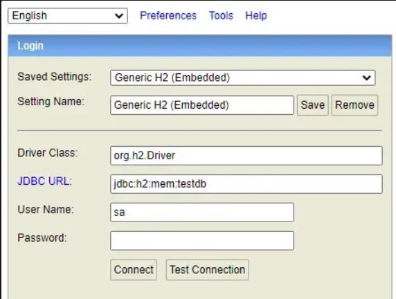

#  Ninja API -- Java Spring Boot

API para gerenciamento de Ninjas, utilizando **Java**, **Spring Boot**,
**JPA/Hibernate** e **H2 Database**.

------------------------------------------------------------------------

## 📌 Tecnologias usadas

-   Java 21
-   Spring Boot
-   Spring Web
-   Spring Data JPA
-   H2 Database
-   Lombok
-   Maven

------------------------------------------------------------------------

## 🚀 Como Rodar

    mvn spring-boot:run

------------------------------------------------------------------------

## 🛢️ Banco de Dados H2
Console do h2:

    http://localhost:8080/h2-console

No console do **H2** vai vai aparecer algo assim:

Na raiz do projeto crie uma pasta chamada "data":

    /data
No campo **JDBC URL** use:

    jdbc:h2:file:./data/NinjasRegisterDb;

Quando rodar, na raiz do projeto a pasta "data" tera criado um novo arquivo chamado "NinjasRegisterDb"

        /data
        ├── NinjasRegisterDb.mv.db

Configuração exemplo que pode ser usado por .env ou Environment variables:

    DB_URL=jdbc:h2:file:./data/NinjasRegisterDb;DB_CLOSE_DELAY=-1;DB_CLOSE_ON_EXIT=FALSE
    DB_USERNAME=sa
    DB_PASSWORD=

-   `file:` → salva em arquivo\
-   `./data/NinjasRegisterDb` → caminho do banco\
-   `DB_CLOSE_DELAY=-1` → não fecha automaticamente\
-   `DB_CLOSE_ON_EXIT=FALSE` → banco permanece aberto após encerrar app
-------------------------------------------------------------------------

## 📂 Estrutura do Projeto

    src/main/java/dev.devdreamer.NinjasRegister
     ├── Mission
     │    ├── Mission.java
     │    ├── MissionController.java
     │    ├── MissionService.java
     │    └── MissionRepository.java
     │
     └── Ninja
          ├── Ninja.java
          ├── NinjaController.java
          ├── NinjaService.java
          └── NinjaRepository.java
------------------------------------------------------------------------

## 📚 Documentação da API (Swagger)

Acesse o Swagger UI:

    http://localhost:8080/swagger-ui/index.html

-   Lista de endpoints\
-   Modelos de requisição/resposta\
-   Testes diretos no navegador\
-   Visualização de schemas

Endpoints Ninja: - GET /ninjas\
- POST /ninjas\
- GET /ninjas/{id}\
- PUT /ninjas/{id}\
- DELETE /ninjas/{id}

Endpoints Mission: - GET /missions\
- POST /missions\
- GET /missions/{id}\
- DELETE /missions/{id}

------------------------------------------------------------------------

